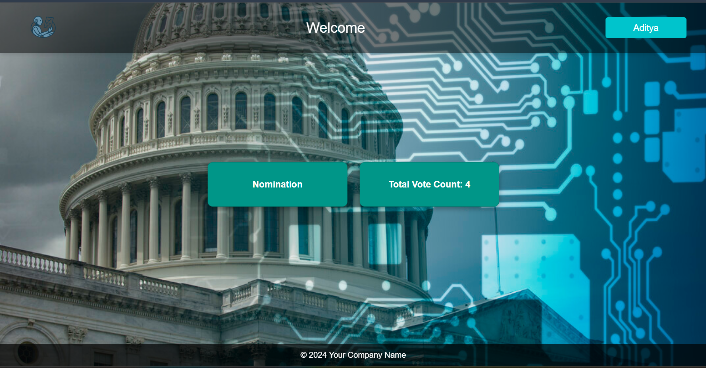
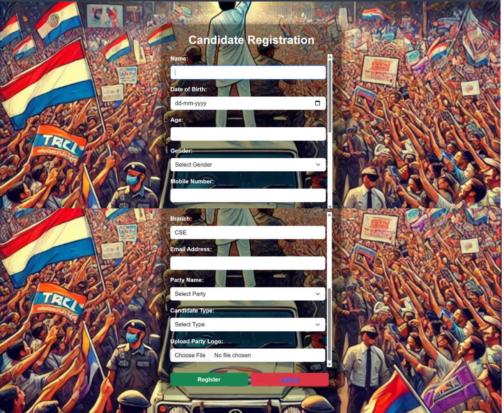
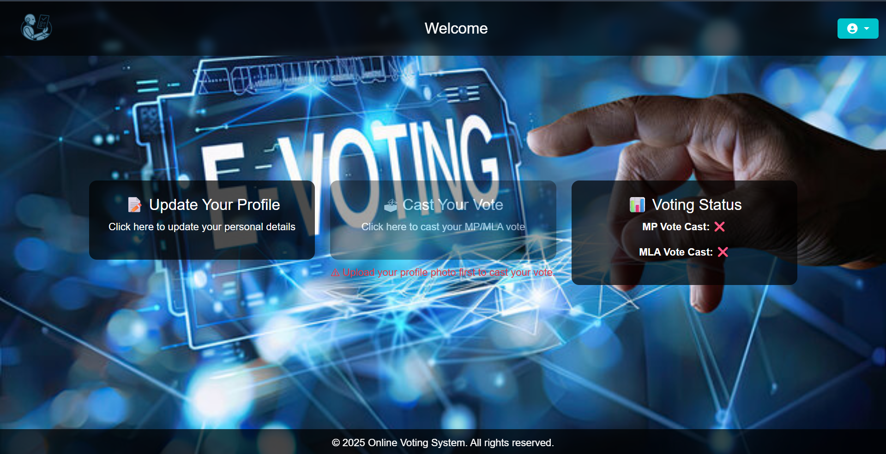
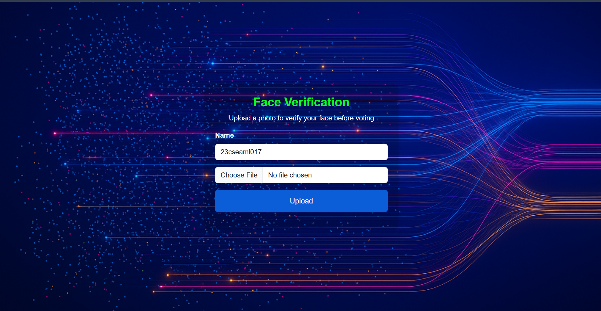
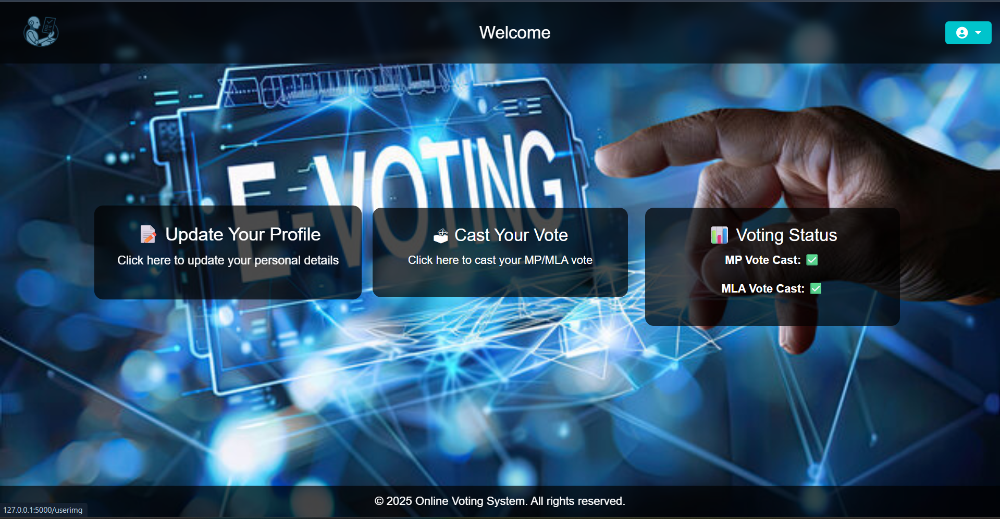
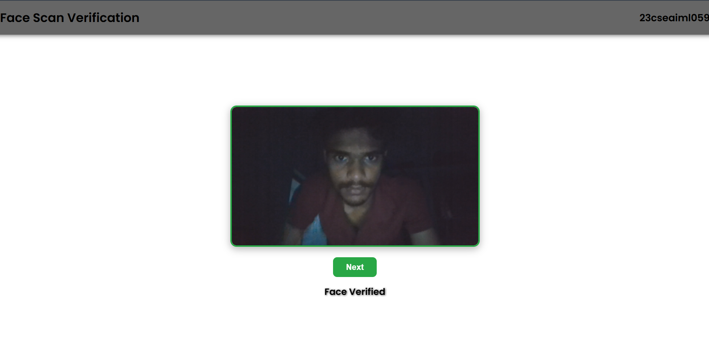
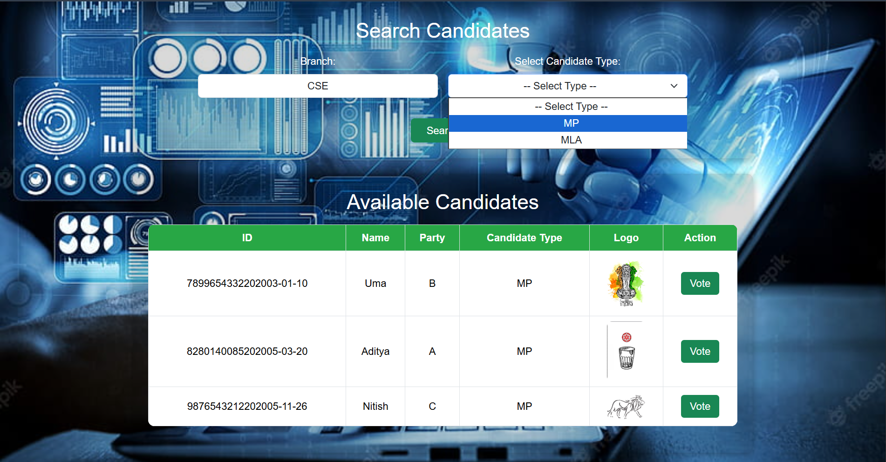
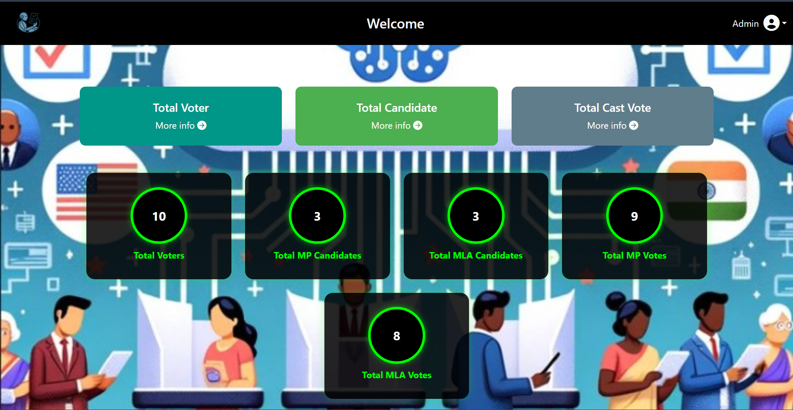
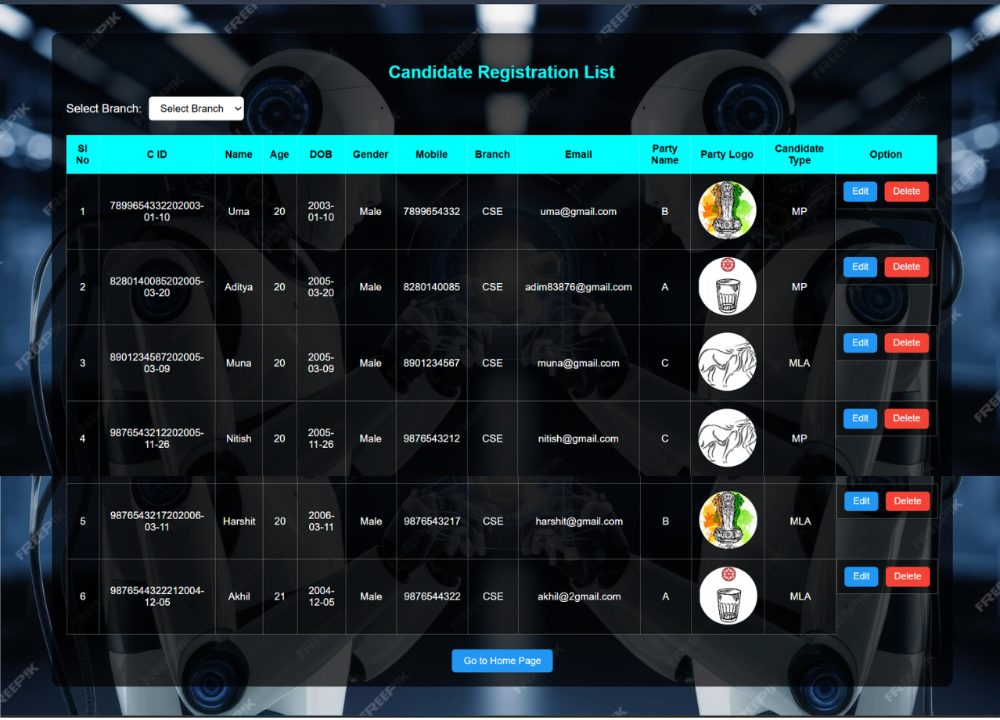

# AI Powered E-Voting System

This is an **AI powered e-voting system** built using:

-   **HTML, CSS, Bootstrap** -- Frontend
-   **Python Flask** -- Backend
-   **OpenCV** -- Face Verification
-   **MySQL** -- Store all voting-related data

The system is fully **responsive** (mobile + desktop) and includes 3
types of users:

-   **Voter** -- Cast the vote
-   **Candidate** -- Do nomination
-   **Admin** -- Manage voting system

------------------------------------------------------------------------

## 🏠 Home Page

**
**

AI powered e-voting home interface.

------------------------------------------------------------------------

## 📝 Signup Page

SQL used for user registration:

``` sql
CREATE TABLE users (
    id INT AUTO_INCREMENT unique,
    username VARCHAR(50) PRIMARY KEY,
    password VARCHAR(100) NOT NULL,
    mobile_no VARCHAR(10) NOT NULL,
    branch VARCHAR(50) NOT NULL,
    gender VARCHAR(10) NOT NULL
);
```

------------------------------------------------------------------------

## 🔐 Signin Page

****

✅ Username Rules
- Voter: **Alphanumeric**
- Candidate: **Alphabetic**
- Admin: **Numeric**

------------------------------------------------------------------------

## 🧑‍🏫 Candidate Panel

### Candidate Home



Candidate can see how many votes he/she received.

### Candidate Nomination

**(Add screenshot: `candidate_reg.png`)**

SQL for candidate nomination:

``` sql
CREATE TABLE candidate_reg (
    id VARCHAR(100) PRIMARY KEY,
    name VARCHAR(100) NOT NULL,
    dob DATE NOT NULL,
    age INT NOT NULL,
    gender VARCHAR(15) NOT NULL,
    mobile VARCHAR(15) NOT NULL,
    email VARCHAR(100) NOT NULL,
    branch VARCHAR(100),
    parti_name VARCHAR(100) NOT NULL,
    candidate_type VARCHAR(100) NOT NULL,
    party_logo VARCHAR(255)
);
```

------------------------------------------------------------------------

## 🧑‍💼 Voter Panel

### Voter Home



Voter must upload a photo to enable the **Vote Cast** button.

### Upload Photo


imguplod.png
After photo upload, the button becomes enabled.

### Ready to Vote


------------------------------------------------------------------------

## 📸 Face Verification (OpenCV)


Face scan matches the user's photo stored in the database.\
If matched → **Next button appears**

------------------------------------------------------------------------

## ✅ Vote Cast Page



SQL for storing votes:

``` sql
CREATE TABLE vote_cast (
    id INT AUTO_INCREMENT PRIMARY KEY,
    candidate_id VARCHAR(50) NOT NULL,
    candidate_name VARCHAR(100) NOT NULL,
    parti_name VARCHAR(100) NOT NULL,
    candidate_type VARCHAR(50) NOT NULL,
    user_name VARCHAR(100) NOT NULL
);
```

------------------------------------------------------------------------

## 🛠️ Admin Dashboard



Admin can: - Update user details\
- Delete nomination\
- View results

### Update Page



### Results Page


See which candidate won and total votes.
------------------------------------------------------------------------
## 📁 Project Folder Structure — AI Powered E-Voting System

```text
e-voting-system/
│
├── app.py                         # Main Flask application
│
├── templates/                     # All HTML templates
│   ├── home.html                  # Home page
│   ├── signup.html                # Signup page
│   ├── signin.html                # Signin page
│   ├── u_home.html                # Voter home
│   ├── upload.html                # Voter photo upload
│   ├── faceverification.html      # OpenCV face scan page
│   ├── votecast.html              # Vote cast page
│   ├── chome.html                 # Candidate home
│   ├── creg.html                  # Candidate nomination
│   ├── adminhome.html             # Admin dashboard
│   ├── update.html                # Admin update user/candidate
│   ├── result.html                # Election results
│
├── static/                        # Frontend static files
│   ├── css/                       # Stylesheets
│   │   ├── style.css
│   │   └── ...
│   │
│   ├── js/                        # JavaScript files
│   │   ├── script.js
│   │   └── ...
│   │
│   ├── assets/                    # Background images / icons
│   │   ├── bg1.jpg
│   │   ├── bg2.png
│   │   └── ...
│   │
│   └── upload/                    # Uploaded files
│       ├── party_logo/            # Candidate party logos
│       │   ├── logo1.png
│       │   └── ...
│       │
│       └── face_upload/           # Voter face upload images
│           ├── 10001.jpg
│           └── ...
│
├── requirements.txt               # Python dependencies
├── README.md                      # Project documentation
└── .gitignore                     # Git ignored files
```

The entire project is organized as follows:


✅ `upload` folder is inside **static/**  
✅ `party_logo` and `face_upload` kept separate  
✅ All HTML pages stay in **templates/**  
✅ app.py is the main backend file  


------------------------------------------------------------------------

## ✅ Summary

This is a complete **AI powered e-voting system** using Flask, OpenCV
and MySQL with role-based access for Admin, Candidate and Voter.\
Screenshots should be placed in a folder like:

    /docs/images/

and referenced inside the README.

------------------------------------------------------------------------

## ✅ How to Run the Project

``` bash
git clone <your-repo-url>
cd AI_Based_voting_system
pip install -r requirements.txt
python app.py
```


